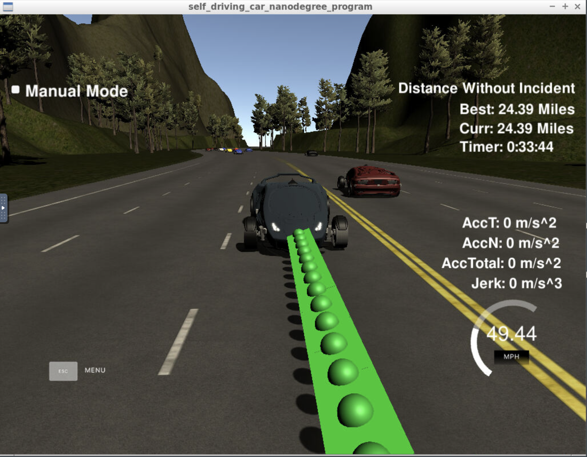

# CarND-Path-Planning-Project

## Goals
In this project your goal is to safely navigate around a virtual highway with other traffic that is driving +-10 MPH of the 50 MPH speed limit. You will be provided the car's localization and sensor fusion data, there is also a sparse map list of waypoints around the highway. The car should try to go as close as possible to the 50 MPH speed limit, which means passing slower traffic when possible, note that other cars will try to change lanes too. The car should avoid hitting other cars at all cost as well as driving inside of the marked road lanes at all times, unless going from one lane to another. The car should be able to make one complete loop around the 6946m highway. Since the car is trying to go 50 MPH, it should take a little over 5 minutes to complete 1 loop. Also the car should not experience total acceleration over 10 m/s^2 and jerk that is greater than 10 m/s^3.

## Compilation
I used `spline.h` for the interpolation algorithm. And there is no error for the build of the codes using `make`.

## Valid Trajectories

During 33 minutes 44 seconds,

1. The car goes 24.39 miles without incident.
1. The car drives according to the speed limit.
1. Max Acceleration and Jerk are not Exceeded.
1. Car does not have collisions.
1. The car stays in its lane, except for the time between changing lanes.
1. The car is able to change lanes under the circumstance.

## Reflection
Because there are no traffic signs, pedestrian, and bikes, this project is very simple path planning project.
So I think that the simple planning algorithm is enough to satisfy the rubric points of this project.

The prediction of neighbor cars in `line 118 ~ 179` is implemented. Using sensor fusion data and the size of `previous_path_x`, I computed future `s` position and lane of neighbor cars. I predict 6 categories: `{behind, ahead}` and `{left, center, right}`.
With this criteria, positions of 6 neareast cars are obtained in `line 181 ~ 223`. I treated the follwoing exceptional cases:

- At the end of high way, car position ranged from 0 to 6945.554 is properly computed.
- there is `d = 0.0` in sensor fusion data. So I calculated s and d position with getFrenet() with x and y position of sensor fusion data as written.

At `line 238 ~ 263` of main.cpp, planning behavior of car is implemented. My model is reasonably simple. There are three criteria: The existence of a car ahead, availability of other laens, and the accelation. In the case of lane change, I just want to change only 1 lane not multiple lanes at a time.

The trajectory generation (`line 265 ~ 373`) is almost same of the lecture video. I referenced the Q&A board and peer chat in the classroom.
The trajectory is obtained from previous path points, lane and speed from the planning step.
The last two path positions of previous trajectory and three position (30m, 60m, 90m) are also used for generating spline (`spline.h`)interpolation curve.
The coordinate of the points is changed into the car's coordination for the convinient calculation.
Previous path are included for smooth continuity of trajectory. The rest are generated from spline interpolation with coordinate transform form car's one to map's x, y position. I used 50 points for this trajectory generation.